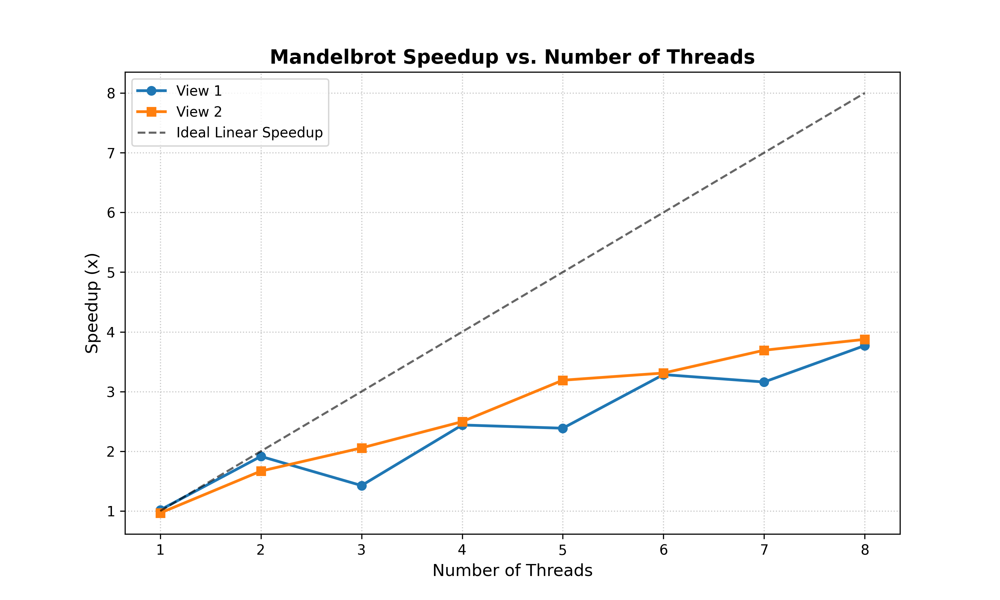
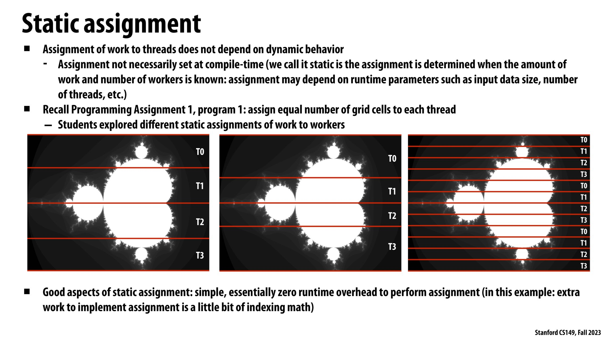
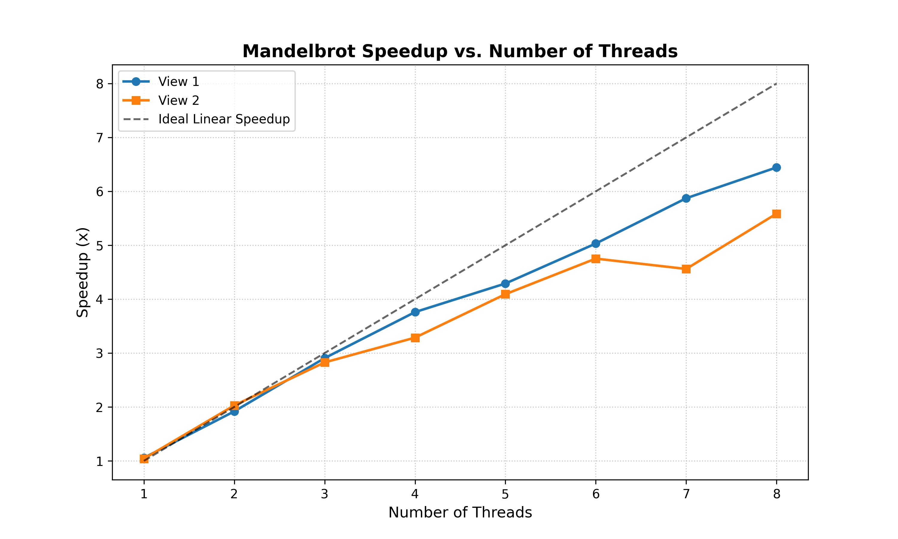
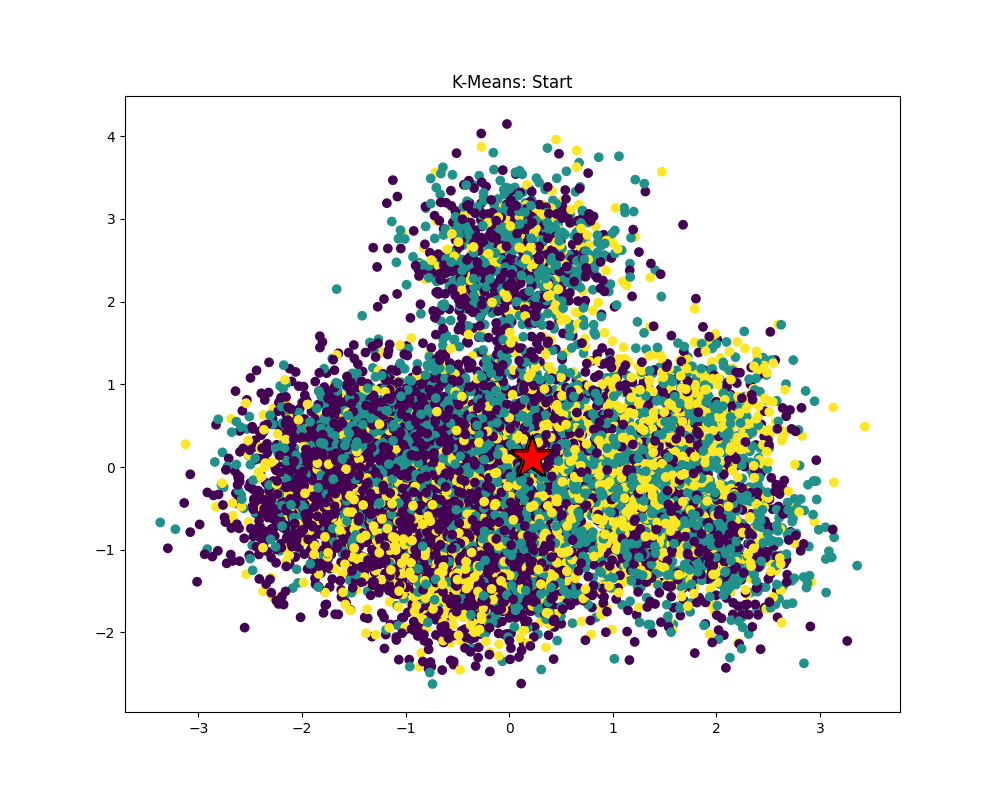
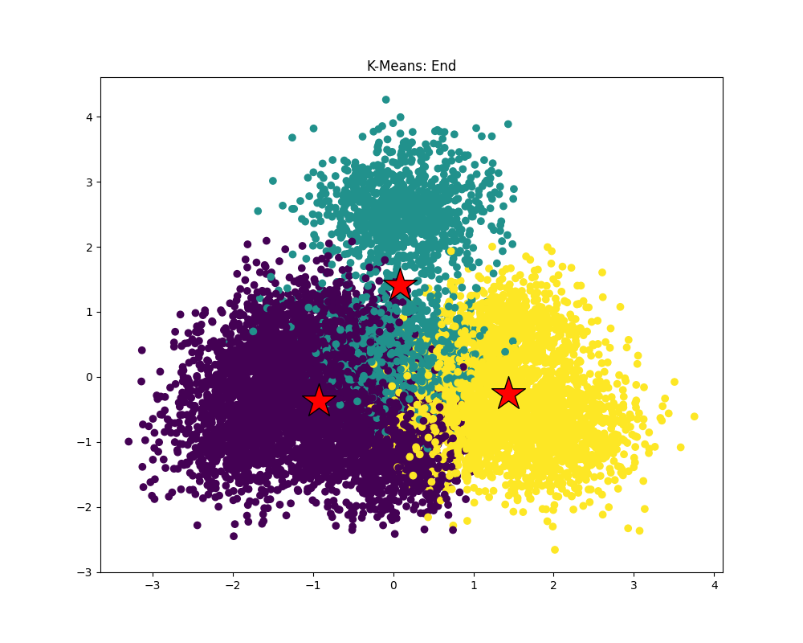

# Report for Assignment 1: Performance Analysis on a Quad-Core CPU

Assignment Description: [Assignment 1: Performance Analysis on a Quad-Core CPU](https://github.com/stanford-cs149/asst1)

## Table of Contents
* [Program 1: Parallel Fractal Generation Using Threads](#program-1-parallel-fractal-generation-using-threads)
* [Program 2: Vectorizing Code Using SIMD Intrinsics](#program-2-vectorizing-code-using-simd-intrinsics)
* [Program 3: Parallel Fractal Generation Using ISPC](#program-3-parallel-fractal-generation-using-ispc)
* [Program 4: Iterative `sqrt`](#program-4-iterative-sqrt)
* [Program 5: BLAS `saxpy`](#program-5-blas-saxpy)
* [Program 6: Making `K-Means` Faster](#program-6-making-k-means-faster)

## Program 1: Parallel Fractal Generation Using Threads

#### Requirement 1 & 2 & 3

In the naive approach, the image is evenly partitioned spatially: each thread processes `args->height / args->numThreads` contiguous rows. To handle uneven divisions, the final thread is responsible for computing any remaining rows to guarantee the entire image is processed.

```C++
void workerThreadStart(WorkerArgs * const args) {

    // TODO FOR CS149 STUDENTS: Implement the body of the worker
    // thread here. Each thread should make a call to mandelbrotSerial()
    // to compute a part of the output image.  For example, in a
    // program that uses two threads, thread 0 could compute the top
    // half of the image and thread 1 could compute the bottom half.

    //printf("Hello world from thread %d\n", args->threadId);
    
    /**********/
    // Naive Approach
    double t_startTime = CycleTimer::currentSeconds();

    int offset = args->height / args->numThreads;
    int startRow = args->threadId * offset;
    int numRows = (args->threadId == args->numThreads - 1)
                ? (args->height - startRow) 
                : offset; 
    
    mandelbrotSerial(
        args->x0, args->y0, args->x1, args->y1,
        args->width, args->height,
        startRow,
        numRows,
        args->maxIterations,
        args->output
    );

    double t_endTime = CycleTimer::currentSeconds();
    printf("Thread %d: [%.3f] ms\n", args->threadId, (t_endTime - t_startTime) * 1000);
    /**********/
}
```

Ideally, the speedup should scale linearly with the number of threads. However, the plot below reveals disappointing performance, particularly at the 3-thread configuration in View 1.



By following the provided hints, the execution time for the 3-thread scenario in View 1 was recorded as follows:

```txt
$ ./mandelbrot -t 3
[mandelbrot serial]:            [411.223] ms
Wrote image file mandelbrot-serial.ppm
Thread 0: [98.970] ms
Thread 2: [99.344] ms
Thread 1: [268.537] ms
Thread 0: [85.521] ms
Thread 2: [86.088] ms
Thread 1: [254.888] ms
Thread 0: [87.435] ms
Thread 2: [87.597] ms
Thread 1: [258.570] ms
Thread 0: [86.487] ms
Thread 2: [87.530] ms
Thread 1: [256.238] ms
Thread 2: [117.944] ms
Thread 0: [127.304] ms
Thread 1: [299.421] ms
[mandelbrot thread]:            [255.385] ms
Wrote image file mandelbrot-thread.ppm
                                (1.61x speedup from 3 threads)
```

The log clearly shows a severe load imbalance: `Thread 1` took significantly longer to execute than `Thread 0` and `Thread 2`. This occurs because the center of the Mandelbrot set requires significantly more iterations to compute, creating a computationally dense zone. Furthermore, the anomaly where the 3-thread speedup is actually lower than the 2-thread speedup indicates that `Thread 1` in the 3-thread scenario was assigned a heavier, more concentrated workload than any single thread in the 2-thread configuration.

#### Requirement 4 & 5

To address this spatial load imbalance, an interleaved assignment strategy was implemented based on the course slides.



The image rows were divided into `TOTAL_CHUNKS`, and threads were assigned to these chunks in a round-robin manner. This method significantly improves load-balancing because adjacent chunks typically share a similar computational cost, distributing the heavy workloads more evenly across all threads.

```C++
void workerThreadStart(WorkerArgs * const args) {

    // TODO FOR CS149 STUDENTS: Implement the body of the worker
    // thread here. Each thread should make a call to mandelbrotSerial()
    // to compute a part of the output image.  For example, in a
    // program that uses two threads, thread 0 could compute the top
    // half of the image and thread 1 could compute the bottom half.

    //printf("Hello world from thread %d\n", args->threadId);
    
    /**********/
    // Block-Interleaved
    double t_startTime = CycleTimer::currentSeconds();

    const int TOTAL_CHUNKS = 128;
    int offset = args->height / TOTAL_CHUNKS;
    
    for(int chunk = args->threadId; chunk < TOTAL_CHUNKS; chunk += args->numThreads) {
        int startRow = chunk * offset;
        int numRows = (chunk == TOTAL_CHUNKS - 1)
                    ? (args->height - startRow) 
                    : offset; 

        if(chunk == 0) printf("Divided into %d chunks.\n", TOTAL_CHUNKS);
        
        mandelbrotSerial(
            args->x0, args->y0, args->x1, args->y1,
            args->width, args->height,
            startRow,
            numRows,
            args->maxIterations,
            args->output
        );
    }

    double t_endTime = CycleTimer::currentSeconds();
    printf("Thread %d: [%.3f] ms\n", args->threadId, (t_endTime - t_startTime) * 1000);
    /**********/
}
```

This approach proved to be highly effective.



In View 1, the 8-thread speedup increased to 6.3x, which is a substantial improvement over the naive approach. Nevertheless, a perfect linear speedup remains unattainable. According to Amdahl's Law, this ceiling is dictated by the sequential overhead of the program, such as thread creation, context switching, and the final synchronization.

To stress-test the system, a 16-thread configuration was examined, but it yielded a speedup of only 8.5x. Investigating the hardware configuration revealed the root cause:

```txt
$ lscpu
Architecture:                         x86_64
CPU op-mode(s):                       32-bit, 64-bit
Byte Order:                           Little Endian
Address sizes:                        39 bits physical, 48 bits virtual
CPU(s):                               16
On-line CPU(s) list:                  0-15
Thread(s) per core:                   2
Core(s) per socket:                   8
```

The system features an 8-core, 16-thread architecture (8 physical cores with Hyper-Threading). Consequently, the performance stops improving once we go beyond 8 threads. This hardware limitation perfectly explains why scaling up to 32 threads provided only a marginal improvement with 8.9x speedup.

## Program 2: Vectorizing Code Using SIMD Intrinsics

#### Requirement 1

The implementation is as follows:

```C++
void clampedExpVector(float* values, int* exponents, float* output, int N) {

  //
  // CS149 STUDENTS TODO: Implement your vectorized version of
  // clampedExpSerial() here.
  //
  // Your solution should work for any value of
  // N and VECTOR_WIDTH, not just when VECTOR_WIDTH divides N
  //

  __cs149_vec_float x;
  __cs149_vec_int y;
  __cs149_vec_int count;
  __cs149_vec_float result;
  __cs149_vec_float zero_float = _cs149_vset_float(0.f);
  __cs149_vec_float one_float = _cs149_vset_float(1.f);
  __cs149_vec_int zero_int = _cs149_vset_int(0);
  __cs149_vec_int one_int = _cs149_vset_int(1);
  __cs149_vec_float bound_999 = _cs149_vset_float(9.999999f);
  
  __cs149_mask maskValid, maskIsZero, maskIsNotZero, maskIsPositive, maskNeedClamp;

  for (int i=0; i<N; i+=VECTOR_WIDTH) {
    int validLanes = min(N-i, VECTOR_WIDTH);
    maskValid = _cs149_init_ones(validLanes);

    _cs149_vload_float(x, values+i, maskValid);     // float x = values[i];
    _cs149_vload_int(y, exponents+i, maskValid);    // int y = exponents[i];

    maskIsZero = _cs149_init_ones(0);
    _cs149_veq_int(maskIsZero, y, zero_int, maskValid);                 // if (y == 0) {
    _cs149_vstore_float(output+i, one_float, maskIsZero);               //   output[i] = 1.f;

    maskIsNotZero = _cs149_mask_not(maskIsZero);
    maskIsNotZero = _cs149_mask_and(maskIsNotZero, maskValid);             // } else {
    _cs149_vmove_float(result, x, maskIsNotZero);                       //   float result = x;
    _cs149_vsub_int(count, y, one_int, maskIsNotZero);                  //   int count = y - 1;

    maskIsPositive = _cs149_init_ones(0);
    _cs149_vgt_int(maskIsPositive, count, zero_int, maskIsNotZero);
    int nonZeroCount = _cs149_cntbits(maskIsPositive);

    while(nonZeroCount > 0) {                                           //   while (count > 0) {
      _cs149_vmult_float(result, result, x, maskIsPositive);            //     result *= x;
      _cs149_vsub_int(count, count, one_int, maskIsPositive);           //     count--;

      maskIsPositive = _cs149_init_ones(0);
      _cs149_vgt_int(maskIsPositive, count, zero_int, maskIsNotZero);
      nonZeroCount = _cs149_cntbits(maskIsPositive);                    //   }
    }

    maskNeedClamp = _cs149_init_ones(0);
    _cs149_vgt_float(maskNeedClamp, result, bound_999, maskIsNotZero);  //   if (result > 9.999999f) {
    _cs149_vmove_float(result, bound_999, maskNeedClamp);               //     result = 9.999999f;  }
    _cs149_vstore_float(output+i, result, maskIsNotZero);               //   output[i] = result;  }

    addUserLog("clampedExpVector");
  }
}
```

Key design considerations for this implementation include:

- **Handling Unaligned Array Lengths**: In cases where `N` is not perfectly divisible by `VECTOR_WIDTH`, a dynamic mask (`maskValid`) is calculated instead of naively using a full mask. This approach handles the trailing elements seamlessly without requiring a redundant sequential loop. The `maskValid` is constructed as follows:
```c++
// for (int i=0; i<N; i+=VECTOR_WIDTH) 
int validLanes = min(N-i, VECTOR_WIDTH);
maskValid = _cs149_init_ones(validLanes);
```

- **Reducing Bitwise Inversion Hazards**: Because `maskValid` acts as the strict boundary for safe operations, any derived masks involving bitwise logic must be handled with care. For instance, applying `_cs149_mask_not` to a mask will flip the inactive trailing lanes from `0` to `1`. To prevent these lanes from becoming active, an additional bitwise AND operation with `maskValid` is mandatory:

```c++
maskIsZero = _cs149_init_ones(0);
_cs149_veq_int(maskIsZero, y, zero_int, maskValid);

maskIsNotZero = _cs149_mask_not(maskIsZero);
maskIsNotZero = _cs149_mask_and(maskIsNotZero, maskValid);
```

- **Vectorized Loop Condition**: The `_cs149_cntbits` function serves as an condition checker for the vectorized `while(count > 0)` loop. By counting the number of active bits in `maskIsPositive`, the loop will continue executing as long as at least one vector lane still needs to process its exponent.

#### Requirement 2

As the `VECTOR_WIDTH` increases, , the vector utilization gradually decreases, as shown in the statistics below:

```txt
****************** Printing Vector Unit Statistics *******************
Vector Width:              2
Total Vector Instructions: 167729
Vector Utilization:        83.2%
Utilized Vector Lanes:     279074
Total Vector Lanes:        335458
****************** Printing Vector Unit Statistics *******************
Vector Width:              4
Total Vector Instructions: 97077
Vector Utilization:        78.0%
Utilized Vector Lanes:     303000
Total Vector Lanes:        388308
****************** Printing Vector Unit Statistics *******************
Vector Width:              8
Total Vector Instructions: 52879
Vector Utilization:        75.4%
Utilized Vector Lanes:     319050
Total Vector Lanes:        423032
****************** Printing Vector Unit Statistics *******************
Vector Width:              16
Total Vector Instructions: 27594
Vector Utilization:        74.2%
Utilized Vector Lanes:     327704
Total Vector Lanes:        441504
```

In a SIMD architecture, control flow structures like `if-else` and `while` statements are flattened using masked execution. When data elements within the same vector register take different control paths, the hardware must execute all branches sequentially, masking out the inactive lanes.

Consequently, as the vector width grows, the probability increases that at least one lane will require a high number of `while` loop iterations. This forces the rest of the lanes — which may have already finished their computations — to remain idle (masked out) but still consume clock cycles, thereby degrading the overall vector utilization.

#### Bonus

By utilizing the `hadd` and `interleave` functions suggested in the assignment hints, a parallel approach for `arraySumVector()` was implemented as follows:

```c++
float arraySumVector(float* values, int N) {
  
  //
  // CS149 STUDENTS TODO: Implement your vectorized version of arraySumSerial here
  //
  
  float sum;
  float arr[VECTOR_WIDTH];
  __cs149_vec_float v_sum = _cs149_vset_float(0.f);
  __cs149_vec_float val;
  __cs149_mask maskAll = _cs149_init_ones();
  __cs149_mask maskValid;
  
  for (int i=0; i<N; i+=VECTOR_WIDTH) {
    int validLanes = min(N-i, VECTOR_WIDTH);
    maskValid = _cs149_init_ones(validLanes);

    _cs149_vload_float(val, values+i, maskValid);
    _cs149_vadd_float(v_sum, v_sum, val, maskValid);
  }

  for (int i=1; i<VECTOR_WIDTH; i <<= 1) {
    _cs149_hadd_float(v_sum, v_sum);
    _cs149_interleave_float(v_sum, v_sum);
  }

  _cs149_vstore_float(arr, v_sum, maskAll);
  sum = arr[0];

  addUserLog("arraySumVector");
  return sum;
}
```

Notice that inside the second `for` loop, each `hadd` + `interleave` step effectively halves the number of elements waiting to be summed.  This optimized method brings the overall time complexity of `arraySumVector()` down to
$O(\frac{N}{\text{VECTOR\_WIDTH}} + \log_2(\text{VECTOR\_WIDTH}))$


## Program 3: Parallel Fractal Generation Using ISPC

### Program 3, Part 1. A Few ISPC Basics

#### Requirement 1

Ideally, utilizing 8-wide AVX2 vector instructions to process parallel workloads should yield roughly an 8x speedup. However, the result below shows a sub-optimal outcome:

```txt
$ ./mandelbrot_ispc --view 1
[mandelbrot serial]:            [206.285] ms
Wrote image file mandelbrot-serial.ppm
[mandelbrot ispc]:              [58.235] ms
Wrote image file mandelbrot-ispc.ppm
                                (3.54x speedup from ISPC)
```

Similar to the phenomenon observed in Program 2, SIMD divergence is primarily responsible for this performance degradation. The variance in the computational cost of adjacent pixels results in terrible vector utilization. In other words, early-terminating SIMD lanes must be masked out and remain idle while waiting for the slowest pixel in the gang to finish.

This chaotic circumstance is far more severe in View 2:

```txt
$ ./mandelbrot_ispc --view 2
[mandelbrot serial]:            [116.748] ms
Wrote image file mandelbrot-serial.ppm
[mandelbrot ispc]:              [40.838] ms
Wrote image file mandelbrot-ispc.ppm
                                (2.86x speedup from ISPC)
```

### Program 3, Part 2: ISPC Tasks

#### Requirement 1

The speedup using the default `mandelbrot_ispc_withtasks` is approximately 7x, which is twice as fast as using ISPC without tasks:

```txt
$ ./mandelbrot_ispc --view 1 --task
[mandelbrot serial]:            [206.362] ms
Wrote image file mandelbrot-serial.ppm
[mandelbrot ispc]:              [58.234] ms
Wrote image file mandelbrot-ispc.ppm
[mandelbrot multicore ispc]:    [29.247] ms
Wrote image file mandelbrot-task-ispc.ppm
                                (3.54x speedup from ISPC)
                                (7.06x speedup from task ISPC)
```

This result suggests that combining Data-Level Parallelism (via ISPC vectorization) with Thread-Level Parallelism (via ISPC tasks) allows the performance to scale significantly.

#### Requirement 2

To test the speedup with various numbers of tasks, the revised `mandelbrot_ispc_withtasks()` is shown below:

```c++
export void mandelbrot_ispc_withtasks(uniform float x0, uniform float y0,
                                      uniform float x1, uniform float y1,
                                      uniform int width, uniform int height,
                                      uniform int maxIterations,
                                      uniform int output[])
{

    uniform int numTasks = 32;

    uniform int rowsPerTask = height / numTasks;

    // create multi-tasks
    launch[numTasks] mandelbrot_ispc_task(x0, y0, x1, y1,
                                     width, height,
                                     rowsPerTask,
                                     maxIterations,
                                     output); 
}
```

No matter how many tasks is created (even when tested with up to 400 tasks), the hard ceiling of speedup settle at roughly 35x:

```txt
$ ./mandelbrot_ispc --view 1 --task
[mandelbrot serial]:            [206.084] ms
Wrote image file mandelbrot-serial.ppm
[mandelbrot ispc]:              [58.183] ms
Wrote image file mandelbrot-ispc.ppm
[mandelbrot multicore ispc]:    [5.849] ms
Wrote image file mandelbrot-task-ispc.ppm
                                (3.54x speedup from ISPC)
                                (35.24x speedup from task ISPC)
```

This outcome is supported by the following evidence:

- In Program 1, the speedup ceiling for TLP on this 8-core, 16-thread machine was roughly 8x to 9x.
- ISPC's task scheduling and hyper-threading optimize the pipeline stalls, pushing the effective multi-core scaling to roughly 10x.

Hence, multiplying the baseline ISPC single-core speedup (~3.54x) by the maximum multi-core thread scaling (~10x) perfectly explains the empirical ~35x ceiling. The results from View 2 further validate this limit:

```txt
$ ./mandelbrot_ispc --view 2 --task
[mandelbrot serial]:            [116.748] ms
Wrote image file mandelbrot-serial.ppm
[mandelbrot ispc]:              [40.838] ms
Wrote image file mandelbrot-ispc.ppm
[mandelbrot multicore ispc]:    [5.164] ms
Wrote image file mandelbrot-task-ispc.ppm
                                (2.86x speedup from ISPC)
                                (22.61x speedup from task ISPC)
```

#### Bonus

There are two major differences between the thread abstraction (used in Program 1) and the ISPC task abstraction:

1. **Abstractions of Parallelism**: `std::thread` is an OS-level abstraction for TLP. Conversely, ISPC tasks natively possess both TLP (distributing tasks across cores) and DLP (executing the task logic using SIMD vector units).

2. **Creation Overhead and Task Scheduling**: In Program 1, programmers must manually create, manage, and join OS-level threads. ISPC abstracts this away by utilizing a pre-built Thread Pool and a work-stealing scheduler.  ISPC dynamically allocates pending tasks to idle worker threads, eliminating manual assignment and load imbalance.

The thought experiment suggested by the hint highlights this distinction. Launching 10,000 threads would cause devastating context-switching overhead, completely dominating the execution time and weaken parallelism. In contrast, launching 10,000 ISPC tasks simply enqueues 10,000 lightweight objects into a task queue. The fixed number of underlying worker threads will efficiently dequeue and process them, giving the scheduler better flexibility to balance the workload without suffering from system-level thread overhead.

## Program 4: Iterative `sqrt`

#### Requirement 1 & 2 & 3

The speedups of the ISPC implementation for single-core and multi-core are roughly ~4x and ~39x, respectively:

```txt
[sqrt serial]:          [966.162] ms
[sqrt ispc]:            [244.480] ms
[sqrt task ispc]:       [24.791] ms
                                (3.95x speedup from ISPC)
                                (38.97x speedup from task ISPC)
```

Note that the default input values are uniformly distributed in the range (0, 3]:

```C++
values[i] = .001f + 2.998f * static_cast<float>(rand()) / RAND_MAX;
```

To construct specific inputs that maximize or minimize the speedup, the provided iteration plot should be considered:


Notice that calculating the square root of values near 3.0 requires the highest number of iterations. According to Amdahl's Law, maximizing the workload of the parallelizable portion relative to the sequential overhead will yield the highest theoretical speedup.

With this in mind, the input array can be assigned entirely with values near 3.0 to maximize the speedup:

```c++
values[i] = 2.998f + .001f * static_cast<float>(rand()) / RAND_MAX;
```

On the other hand, SIMD control-flow divergence can be intentionally triggered to minimize performance. By mixing one high-iteration value (near 3.0) with seven low-iteration values (near 1.0) within the same 8-wide SIMD gang, 7 vector lanes are forced to idle while waiting for the single slow lane to finish its loop:

```c++
// vetor width is 8
values[i] = (i % 8 == 0)
            ? 2.998f + .001f * static_cast<float>(rand()) / RAND_MAX
            : .5f + 1.0f * static_cast<float>(rand()) / RAND_MAX;
```

The eventual outcomes perfectly demonstrate the maximized and minimized speedups:

```txt
[sqrt serial]:          [2100.569] ms
[sqrt ispc]:            [392.999] ms
[sqrt task ispc]:       [42.646] ms
                                (5.34x speedup from ISPC)
                                (49.26x speedup from task ISPC)
```

```txt
[sqrt serial]:          [650.829] ms
[sqrt ispc]:            [422.324] ms
[sqrt task ispc]:       [46.403] ms
                                (1.54x speedup from ISPC)
                                (14.03x speedup from task ISPC)
```

#### Bonus

The handcrafted AVX2 implementation is shown below:

```c++
#include <math.h>
#include <stdio.h>
#include <stdlib.h>
#include <pthread.h>
#include <math.h>
#include <immintrin.h>

#define VECTOR_WIDTH 8

void sqrtAVX(int N,
             float initialGuess,
             float values[],
             float output[])
{
    __m256 one = _mm256_set1_ps(1.0f);
    __m256 three = _mm256_set1_ps(3.0f);
    __m256 half = _mm256_set1_ps(0.5f);
    __m256 kThreshold = _mm256_set1_ps(0.00001f);
    __m256 x, guess, error, result;

    __m256 maskAbs = _mm256_castsi256_ps(_mm256_set1_epi32(0x7FFFFFFF));
    __m256 maskIsLarger;

    for (int i=0; i<N; i+=VECTOR_WIDTH) {                                   // float x = values[i];
        x = _mm256_loadu_ps(values + i);                                    // float guess = initialGuess;
        guess = _mm256_set1_ps(initialGuess);
        
        __m256 guess_sq = _mm256_mul_ps(guess, guess);                      // guess * guess
        __m256 gsq_mul_x = _mm256_mul_ps(guess_sq, x);                      // guess * guess * x
        __m256 gsq_mul_x_sub_one = _mm256_sub_ps(gsq_mul_x, one);           // guess * guess * x - 1.0f
        
        error = _mm256_and_ps(gsq_mul_x_sub_one, maskAbs);                  // float error = fabs(guess * guess * x - 1.f);

        maskIsLarger = _mm256_cmp_ps(error, kThreshold, _CMP_GT_OQ);        // error > kThreshold

        while(_mm256_movemask_ps(maskIsLarger) != 0) {                      // while (error > kThreshold) {
            __m256 three_mul_guess = _mm256_mul_ps(three, guess);           //     3.f * guess
            __m256 guess_cb = _mm256_mul_ps(guess_sq, guess);               //     guess * guess * guess
            __m256 x_mul_gcb = _mm256_mul_ps(x, guess_cb);                  //     5 * guess * guess * guess
            __m256 p = _mm256_sub_ps(three_mul_guess, x_mul_gcb);           //     p = 3.f * guess - x * guess * guess * guess
            __m256 new_guess = _mm256_mul_ps(p, half);

            guess = _mm256_blendv_ps(guess, new_guess, maskIsLarger);       //     guess = (3.f * guess - x * guess * guess * guess) * 0.5f

            guess_sq = _mm256_mul_ps(guess, guess);                  //     guess * guess
            gsq_mul_x = _mm256_mul_ps(guess_sq, x);                  //     guess * guess * x
            gsq_mul_x_sub_one = _mm256_sub_ps(gsq_mul_x, one);       //     guess * guess * x - 1.0f
            
            error = _mm256_and_ps(gsq_mul_x_sub_one, maskAbs);              //     error = fabs(guess * guess * x - 1.0f)

            maskIsLarger = _mm256_cmp_ps(error, kThreshold, _CMP_GT_OQ);    // error > kThreshold
        }

        result = _mm256_mul_ps(x, guess);
        _mm256_storeu_ps(output + i, result);                               // output[i] = x * guess;
    }
}
```

Because this intrinsic implementation runs strictly on a single core, it must be compared against the single-core ISPC version (`mandelbrot_ispc` without `--tasks`). Across all three cases, the handcrafted AVX2 code slightly outperforms the ISPC's version:

```txt
====================== Averge Case ======================
[sqrt serial]:          [926.040] ms
[sqrt ispc]:            [242.395] ms
                                (3.82x speedup from ISPC)
[sqrt avx2]:            [238.697] ms
                                (3.88x speedup from AVX2)
======================= Best Case =======================
[sqrt serial]:          [2017.997] ms
[sqrt ispc]:            [325.146] ms
                                (6.21x speedup from ISPC)
[sqrt avx2]:            [273.131] ms
                                (7.39x speedup from AVX2)
====================== Worst Case =======================
[sqrt serial]:          [650.725] ms
[sqrt ispc]:            [425.843] ms
                                (1.53x speedup from ISPC)
[sqrt avx2]:            [372.253] ms
                                (1.75x speedup from AVX2)
```

## Program 5: BLAS `saxpy`

#### Requirement 1

The speedup from running the ISPC and ISPC task implementations on the `saxpy` routine is unexpectedly insignificant:

```txt
$ ./saxpy
[saxpy serial]:         [13.091] ms     [22.765] GB/s   [3.056] GFLOPS
[saxpy ispc]:           [13.194] ms     [22.588] GB/s   [3.032] GFLOPS
[saxpy task ispc]:      [11.325] ms     [26.315] GB/s   [3.532] GFLOPS
                                (1.17x speedup from use of tasks)
                                (0.99x speedup from ISPC)
                                (1.16x speedup from task ISPC)
```

This phenomenon indicates that executing a computationally lightweight kernel (like the `saxpy` routine) over a massive array (20 million elements) is a strictly memory-bound problem. In other words, the performance bottleneck is not the lack of ALUs or compute capability, but rather the strictly limited memory bandwidth connecting the CPU and the RAM.

#### Bonus 1 & 2

To address this bandwidth bottleneck, we must examine the CPU cache workflow. During a single vector operation of `result = scale * X + Y`, both `X` and `Y` are fetched from memory into the cache for calculation. However, under the write-allocate cache policy, a write miss occurs when updating `result`. This forces the hardware to fetch the old cache line of `result` from memory into the cache before the new value can be written and eventually written back to RAM.

Consequently, a single `saxpy` computation inherently performs 4 memory transactions (Read `X`, Read `Y`, Read `result`, Write `result`) instead of the strictly necessary 3 transactions. This creates a 33% overhead in memory bandwidth consumption (4x instead of 3x).

With this observation, an ideal 33% performance improvement can be achieved by bypassing the write-allocate policy. By switching to a write-around memory operation, we can prevent `result` from being fetched into the cache. The revised `saxpy_ispc()` in `saxpy.ispc` is shown below:

```c++
export void saxpy_ispc(uniform int N,
                       uniform float scale,
                            uniform float X[],
                            uniform float Y[],
                            uniform float result[])
{
    /******
    //Write-Allocate
    foreach (i = 0 ... N) {           
        result[i] = scale * X[i] + Y[i];
    }
    ******/
    
    /******/
    //Write-Around
    for (uniform int i = 0; i < N; i += programCount) {
        int idx = i + programIndex; 
        float val = scale * X[idx] + Y[idx];

        streaming_store(&result[i], val); 
    }
    /******/
}
```

Utilizing the intrinsic `streaming_store` ensures that the evaluated outcome is written directly to the main memory, completely bypassing the cache hierarchy. As a result, the total bandwidth consumption drops to 3 transactions (Read X, Read Y, Write result). This optimization yields an approximate ~1.33x speedup for both the ISPC and ISPC tasks implementations compared to their previous baseline:

```txt
[saxpy serial]:         [14.341] ms     [20.782] GB/s   [2.789] GFLOPS
[saxpy ispc]:           [10.926] ms     [27.275] GB/s   [3.661] GFLOPS
[saxpy task ispc]:      [8.546] ms      [34.871] GB/s   [4.680] GFLOPS
                                (1.28x speedup from use of tasks)
                                (1.31x speedup from ISPC)
                                (1.68x speedup from task ISPC)
```

## Program 6: Making `K-Means` Faster

#### Requirement 1 & 2 & 3 & 4

By uncommenting the data generation code in `main.cpp`, the baseline K-Means algorithm runs successfully on the local machine:

```txt
$ ./kmeans
Running K-means with: M=1000000, N=100, K=3, epsilon=0.100000
[Total Time]: 7425.634 ms
```




To isolate the performance bottleneck, `CycleTimer::currentSeconds()` was introduced to profile `computeAssignments`, `computeCentroids`, and `computeCost` in `kmeansThread.cpp`. Note that the `dist` function is excluded, as it is a heavily invoked helper function called within both the assignment and cost computation phases.

The profiling results reveal that `computeAssignments` is the primary bottleneck of this K-Means implementation, consuming over 64% of the total runtime. More specifically, assigning data points to their closest centroids accounts for roughly 99% of the time spent within this function:

```txt
$ ./kmeans
Running K-means with: M=1000000, N=100, K=3, epsilon=0.100000

[Assignments Time]: 4807.628 ms
[Centroids Time]:   1132.539 ms
[Cost Time]:        1495.595 ms
-------------------------------
[Init Arrays]:      31.556 ms
[Assign Data]:      4775.543 ms
-------------------------------
[Total Time]: 7435.831 ms
```

According to Amdahl's Law, optimizing this data assignment loop offers the highest potential for a significant overall speedup.

By referencing the thread allocation strategies learned in Program 1, the revised `computeAssignments` was implemented:

```c++
void computeAssignmentsThread(WorkerArgs *const args, double *minDist, int st, int ed) {
  for (int m = st; m < ed; m++) {
    for (int k = args->start; k < args->end; k++) {
      double d = dist(&args->data[m * args->N],
                      &args->clusterCentroids[k * args->N], args->N);
      if (d < minDist[m]) {
        minDist[m] = d;
        args->clusterAssignments[m] = k;
      }
    }
  }
}

void computeAssignments(WorkerArgs *const args) {
  double *minDist = new double[args->M];
  
  // Initialize arrays
  double start1 = CycleTimer::currentSeconds();
  for (int m = 0; m < args->M; m++) {
    minDist[m] = 1e30;
    args->clusterAssignments[m] = -1;
  }
  double end1 = CycleTimer::currentSeconds();
  initArrays += (end1 - start1);

  // Assign datapoints to closest centroids
  double start2 = CycleTimer::currentSeconds();

  // Spawn the worker threads to assign datapoints in parallel
  static constexpr int THREADS = 32;
  std::thread workers[THREADS];
  int offset = args->M / THREADS;

  for(int i = 1; i < THREADS; i++) {
    int st = i * offset;
    int ed = (i == THREADS - 1)
           ? args->M
           : st + offset;
    workers[i] = thread(computeAssignmentsThread, args, minDist, st, ed);
  }

  computeAssignmentsThread(args, minDist, 0, offset);

  // Join worker threads
  for(int i = 1; i < THREADS; i++) {
    workers[i].join();
  }

  double end2 = CycleTimer::currentSeconds();
  assignData += (end2 - start2);

  delete[] minDist;
}
```

With the implementation of 32 threads, the runtime in `[Assign Data]` phase dropped, leading to a highly successful 2.30x overall speedup that exceeds the assignment requirement:

```txt
$ ./kmeans
Running K-means with: M=1000000, N=100, K=3, epsilon=0.100000

[Assignments Time]: 791.951 ms
[Centroids Time]:   1170.876 ms
[Cost Time]:        1524.471 ms
-------------------------------
[Init Arrays]:      36.724 ms
[Assign Data]:      754.593 ms
-------------------------------
[Total Time]: 3487.453 ms
```
